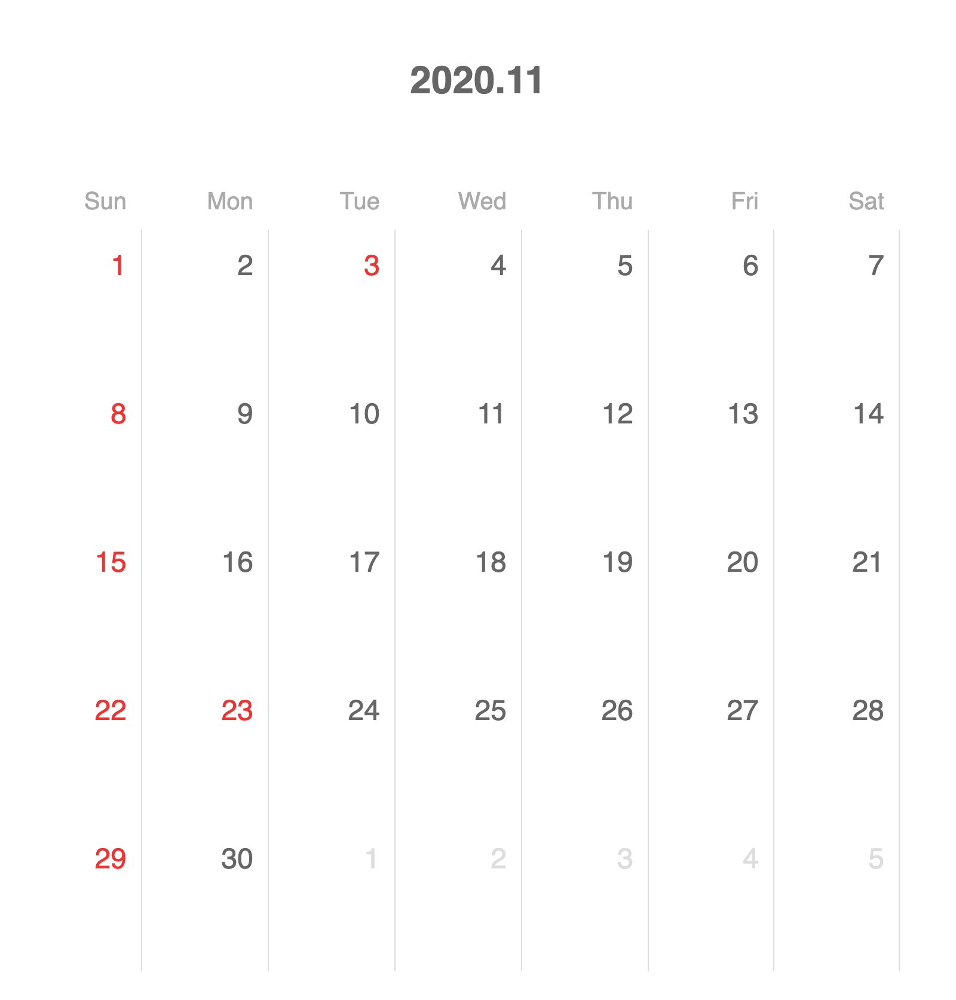

# Calendar Generator

`?month=2020/11&holidays=3,23` の場合のスクリーンショット

店舗のスケジュールを表示するためのカレンダーを作成します。

## 利用方法

表示したい年月と必要に応じて、祝日/休日表示したい日付を `location.search` に入力します。

例) 2020年11月、祝日を11月3日と11月23日で表示したい場合 `?month=2020/11&holidays=3,23` とする

ブラウザで `index.html` を表示するとカレンダーが表示されます。
必要の応じてスクリーンショットなどして利用してください。

## [fuu coffee](https://fuucoffee.com) の場合

Google Chromeを利用して `.calendar-container` 要素を `capture node screenshot` を適用したものを使用しています。
[サンプル](https://www.instagram.com/p/CG90qvUFZXn/)
